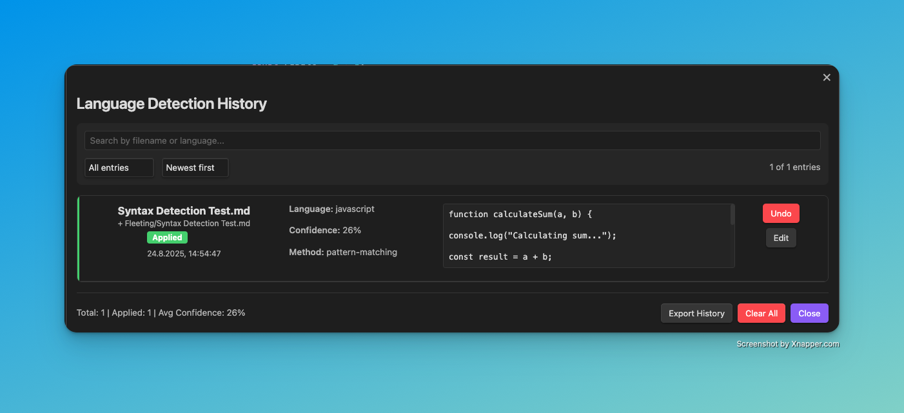
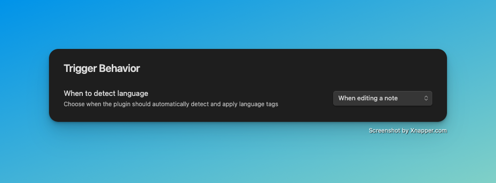
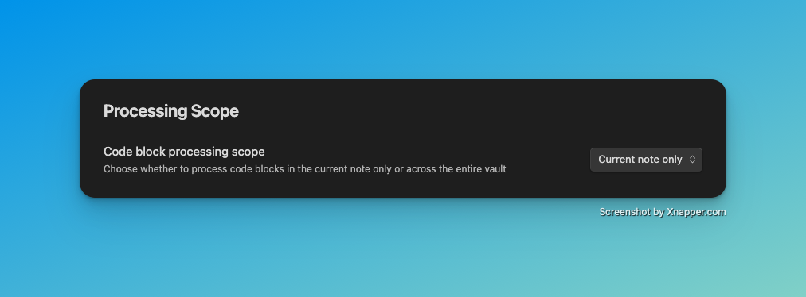
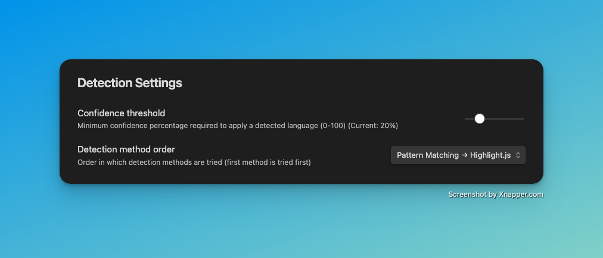
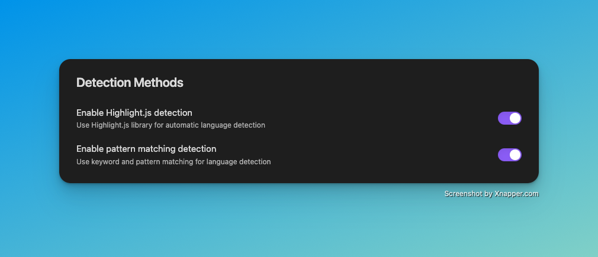
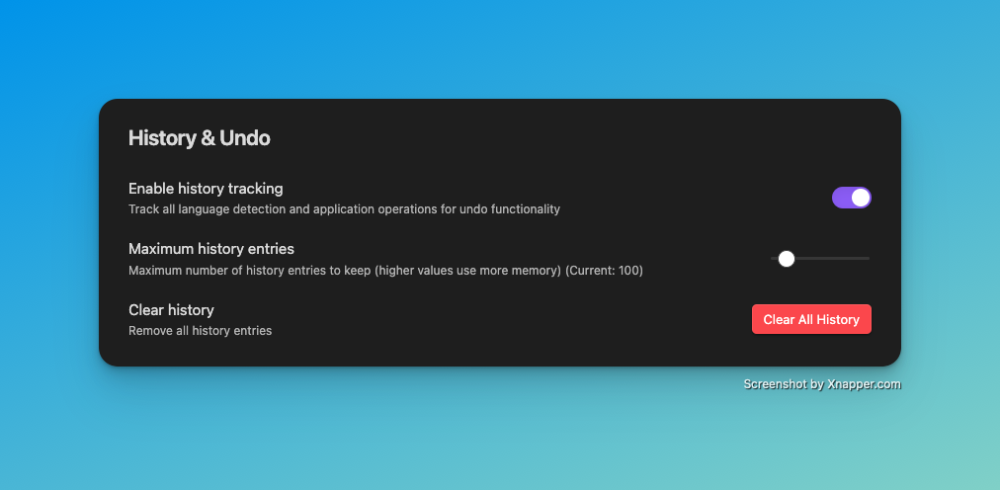
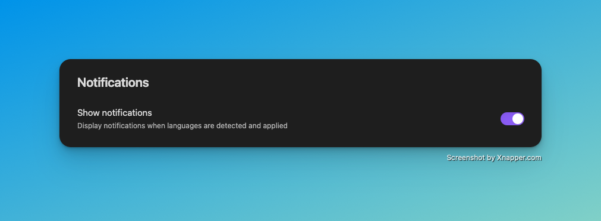
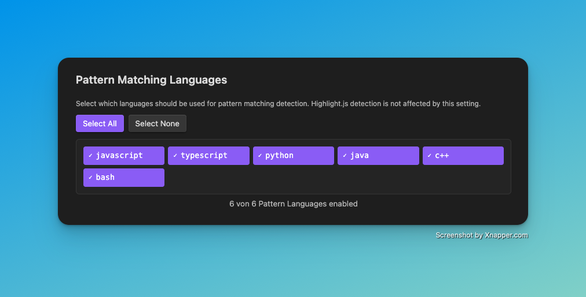

# CodeBlock Language Detector

An intelligent plugin for [Obsidian](https://obsidian.md) that automatically detects the programming language of code blocks and applies appropriate syntax highlighting.

## How It Works

The plugin automatically detects code blocks without language specification and adds the appropriate language tag:

### Before
````
```
def fibonacci(n):
    if n <= 1:
        return n
    return fibonacci(n-1) + fibonacci(n-2)

print(fibonacci(10))
```
````

### After
````
```python
def fibonacci(n):
    if n <= 1:
        return n
    return fibonacci(n-1) + fibonacci(n-2)

print(fibonacci(10))
```
````

The plugin uses two intelligent detection methods:
1. **Highlight.js Detection**: Utilizes the proven Highlight.js library for precise language recognition
2. **Pattern Matching**: Analyzes code keywords, syntax patterns, and typical language constructs

## Installation

### Via Community Plugin Store (Recommended)
1. Open Obsidian Settings
2. Go to "Community plugins"
3. Disable "Safe mode"
4. Click "Browse" and search for "CodeBlock Language Detector"
5. Install and enable the plugin

### Manual Installation
1. Download the latest version from the [Releases page](https://github.com/bueckerlars/obsidian-codeblock-language-detector/releases)
2. Extract files to your vault folder: `VaultFolder/.obsidian/plugins/obsidian-codeblock-language-detector/`
3. Reload Obsidian and enable the plugin in settings

## Features

### 🚀 Automatic Language Detection
- **Two-Stage Detection**: Combines Highlight.js and Pattern Matching for highest accuracy
- **70+ Supported Languages**: Python, JavaScript, TypeScript, Java, C++, Go, Rust, PHP, SQL and many more
- **Configurable Confidence Threshold**: Minimum confidence threshold adjustable from 0-100%

### ⚙️ Flexible Trigger Options
- **On Open**: Automatic detection when opening a note
- **On Edit**: Detection during note editing
- **On Save**: Detection when saving the file
- **Manual**: Only on command via Command Palette

### 🎯 Intelligent Processing Scope
- **Current Note**: Processes only the currently opened note
- **Entire Vault**: Analyzes all notes in the vault

### 📊 Comprehensive History System
- **Complete Tracking**: Stores all detections with timestamps and confidence values
- **Undo Functionality**: Reverse individual or all changes
- **Statistics**: Shows overall detection activity statistics
- **History Browser**: Clear overview of all past actions



### 🔧 Advanced Configuration
- **Method Prioritization**: Determine the order of detection methods
- **Language Filtering**: Select specific languages for Pattern Matching
- **Notifications**: Optional success/status messages
- **Import/Export**: Backup and restore settings

## Settings

The plugin offers extensive configuration options through the settings tab:

### Trigger Behavior


Determine when automatic language detection should be executed:
- **When opening a note**: On opening a note
- **When editing a note**: During editing
- **When saving a note**: On saving
- **Manual only**: Only manually via Command Palette

### Processing Scope


Choose the processing scope:
- **Current note only**: Only the current note
- **Entire vault**: All notes in the entire vault

### Detection Settings


**Confidence Threshold (0-100%)**: Minimum confidence threshold for language detection. Higher values reduce false positives but may also prevent correct detections.

**Detection Method Order**: Determines the order in which detection methods are applied:
- **Highlight.js → Pattern Matching**: First Highlight.js, then Pattern Matching
- **Pattern Matching → Highlight.js**: First Pattern Matching, then Highlight.js

### Detection Methods


**Enable Highlight.js detection**: Uses the proven Highlight.js library for automatic language detection. Very precise for common programming languages.

**Enable Pattern Matching detection**: Uses keyword and pattern matching for language detection. Particularly effective for domain-specific languages.

### History & Undo


**Enable history tracking**: Enables tracking of all detection and application operations for undo functionality.

**Maximum history entries**: Maximum number of history entries to store (10-1000). Higher values require more memory.

**Clear history**: Removes all history entries irreversibly.

### Notifications


**Show notifications**: Display notifications when languages are detected and applied.

### Pattern Matching Languages


Select specific languages for Pattern Matching. Highlight.js detection is not affected by this setting.

**Quick Actions**:
- **Select All**: Enable all available pattern languages
- **Select None**: Disable all pattern languages

**Available Languages**: Over 20 preconfigured language patterns for JavaScript, Python, Java, C++, TypeScript, Bash, SQL and more.

## Usage

### Automatic Detection
Once the plugin is activated, it automatically detects code blocks based on the configured trigger settings. No further action required!

### Manual Commands
Via Command Palette (Ctrl/Cmd + P):

- **Detect language in current note**: Detects languages in the current note
- **Detect language in entire vault**: Analyzes all notes in the vault
- **Show detection history**: Opens the History modal
- **Undo last detection**: Undoes the last detection
- **Clear all detections**: Removes all automatically added language tags

### History Browser
The History modal shows a chronological list of all detection activities:
- **Timestamp**: When the detection occurred
- **File**: In which note the change was made
- **Detected Language**: Which language was detected
- **Confidence**: Confidence value of the detection (0-100%)
- **Method**: Which detection method was used
- **Status**: Whether the change was applied or undone

## Supported Languages

The plugin supports over 70 programming languages through the combination of Highlight.js and Pattern Matching:

**Web Technologies**: JavaScript, TypeScript, HTML, CSS, SCSS, JSON, XML
**Backend Languages**: Python, Java, C#, C++, C, Go, Rust, PHP, Ruby
**Databases**: SQL, MongoDB, Redis
**DevOps**: Bash/Shell, PowerShell, Dockerfile, YAML, TOML
**Functional Languages**: Haskell, Scala, Clojure, F#
**Others**: Markdown, LaTeX, R, MATLAB, Swift, Kotlin, and many more

## Technical Details

### Detection Algorithm
1. **Highlight.js Detection**: Uses statistical analysis and machine learning
2. **Pattern Matching**: Analyzes keywords, syntax patterns, operators, and comment styles
3. **Confidence Scoring**: Each detection receives a confidence value from 0-100%
4. **Fallback Mechanism**: If one method fails, the next one is tried

### Performance
- **Minimal Overhead**: Optimized for large vaults with hundreds of notes
- **Asynchronous Processing**: Does not block the Obsidian user interface
- **Intelligent Caching**: Avoids repeated analysis of unchanged code blocks

## Development

This plugin is Open Source and available under the MIT License. Contributions are welcome!

**Repository**: [GitHub](https://github.com/bueckerlars/obsidian-codeblock-language-detector)
**Issues & Feature Requests**: [GitHub Issues](https://github.com/bueckerlars/obsidian-codeblock-language-detector/issues)

### Local Development
```bash
git clone https://github.com/bueckerlars/obsidian-codeblock-language-detector.git
cd obsidian-codeblock-language-detector
npm install
npm run dev
```

## Support

For issues or questions:
1. Check the [known issues](https://github.com/bueckerlars/obsidian-codeblock-language-detector/issues)
2. Create a new issue with detailed description
3. Use the Discussion forum for general questions

## License

MIT License - see [LICENSE](LICENSE) file for details.

